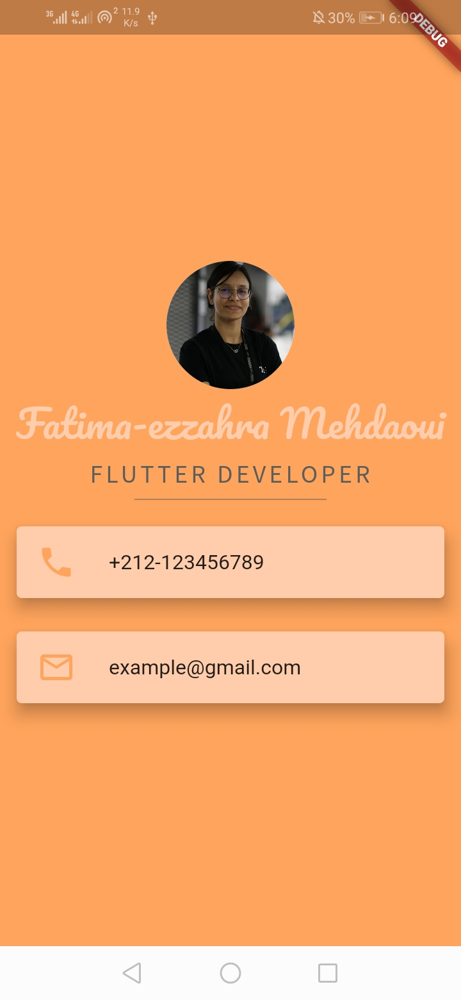
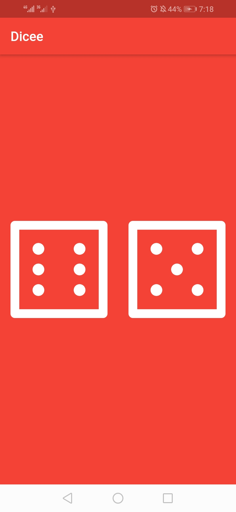
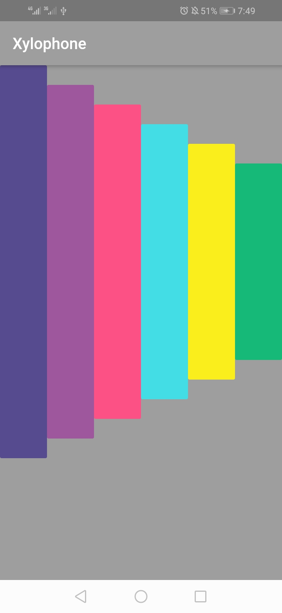
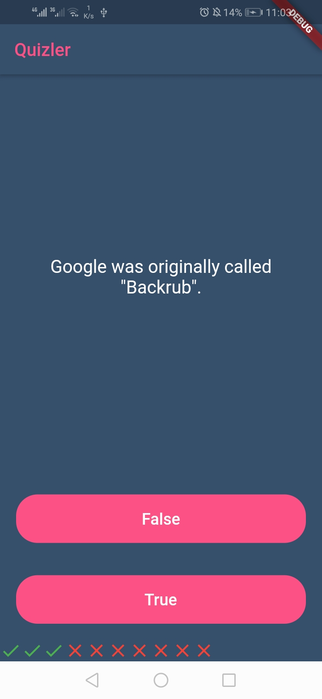

# Flutter Bootcamp - The App Brewery 

### Description

- this repo containes all the apps which you are going to build following : The Complete 2020 Flutter Development Bootcamp with Dart course by [Angela Yu](https://github.com/angelabauer) - [The App Brewery](https://www.appbrewery.co)

### What you will learn

 Flutter development bootcamp teaches you how to code using Dart and build beautiful, fast, native-quality iOS and Android apps, you will lear how to :
 
- Build beautiful, fast and native-quality apps with Flutter
- Become a fully-fledged Flutter developer
- Build iOS and Android apps with just one codebase
- Build iOS and Android apps using just one programming language (Dart)
- Build a portfolio of beautiful Flutter apps to impress any recruiter
- Understand all the fundamental concepts of Flutter development
- Become proficient in one of the fastest growing technologies

## Module 1 - ImRich!

## Module 2 - MiCard

## Module 3 - Dicee

## Module 4 - MagicBall

## Module 5 - Xylophone

## Module 6 - Quizzler

Made with :heart: and Flutter.
